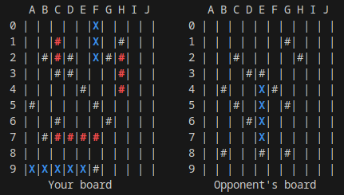

# Battleship Game in Rust 🌊

Welcome to the Battleship Game implemented in Rust! Engage in a thrilling game of strategy and skill against an AI opponent on the high seas. Sink your opponent's fleet before they sink yours! 

## 🔧 Features

- **Interactive Gameplay**: Command your fleet and take turns attacking your opponent's ships.
- **Dynamic Opponent**: The AI makes decisions based on a heatmap and hit tracking.
- **Visual Feedback**: Colored output to indicate hits, misses, and your ships' status.
- **Automatic Ship Placement**: Ships are randomly placed on the grid, ensuring a unique experience each time.
- **Player-Friendly Input**: Intuitive position input system using coordinates (e.g., A1, J10).

## 🎮 How to Play

1. **Objective**: Destroy all enemy ships before they destroy yours.
2. **Turn-Based Gameplay**:
   - You make your move by selecting a coordinate to attack (e.g., A5).
   - The AI then makes its move, with a smart strategy for targeting ships.
3. **Win Condition**: The game ends when all ships of either player are sunk.

## 📊 Board Representation

- The board is a 10x10 grid labeled with letters (A-J) for columns and numbers (0-9) for rows.
- Your board and the opponent's board are displayed side by side:



<style>
r { color: Red }
b { color: Blue }
g { color: Green }
</style>

### Symbols:
- ` `: Empty cell
- #: Missed shot
- <r>#</r>: Hit shot
- <b>X</b>: Visible ship (your ship or ship sunk by you)

## 🛠️ Setup Instructions

1. Install Rust from [Rust's official website](https://www.rust-lang.org/).
2. Clone this repository:
   ```bash
   git clone <repository-url>
   cd battleship
   ```
3. Build and run the game:
   ```bash
   cargo run
   ```

## 🎮 Game Logic

- **Ship Placement**:
  Ships of varying lengths (5, 4, 3, 3, 2) are randomly placed on the board without overlap or adjacency.

- **AI Strategy**:
  The AI utilizes a heatmap to determine optimal moves and targets ships intelligently by continuing hits on partially discovered ships.

- **Player Input**:
  Input coordinates in the format `[Letter][Digit]` (e.g., A1). Invalid inputs prompt re-entry.

## 🌈 Highlights

- Smart AI opponent using Rust's powerful random and multithreading features.
- Utilizes the `regex` crate for input validation and the `colored` crate for terminal output.
- Responsive gameplay with a 1-second delay for the opponent's move, adding realism.

## 🚀 Future Enhancements

- Multiplayer support.
- Customizable board sizes and ship configurations.

## 🔧 Dependencies

- `rand`: For generating random numbers.
- `regex`: For validating player input.
- `colored`: For colorful terminal output.

Install dependencies with:
```bash
cargo build
```

## 🚒 Contributing

Contributions are welcome! Feel free to submit issues or pull requests to improve the game.

## 🌟 License

This project is licensed under the MIT License. See the LICENSE file for details.
